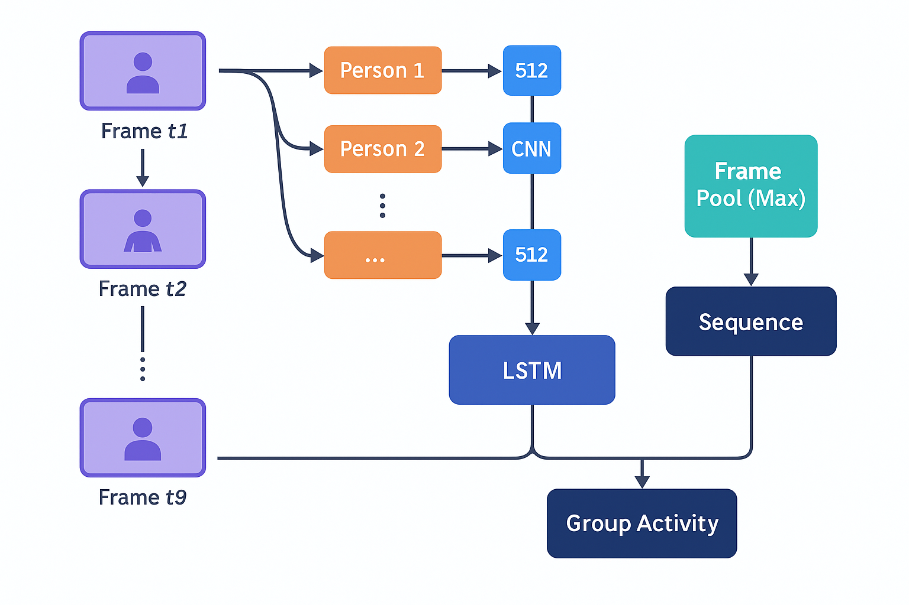

# 🏃‍♂️ Group Activity Recognition (Collective Activity Dataset)

## 📄 Project Overview

This project implements a **Hierarchical CNN + LSTM pipeline** for recognizing **group activities** from video sequences, inspired by the paper:  
> **"A Hierarchical Deep Temporal Model for Group Activity Recognition"**  
> *Mostafa S. Ibrahim, Shengyu Zhang, Stan Sclaroff, Margrit Betke*  
> [https://arxiv.org/abs/1511.06040](http://arxiv.org/pdf/1511.06040)

### **Dataset:**
**Collective Activity Dataset (University of Michigan / Stanford CVGL)**  
Activities: **Crossing, Waiting, Queueing, Walking, Talking**

---

## 🚀 Pipeline Architecture (CNN + LSTM)

<p align="center">
  
</p>

---

## 🔧 Installation
```bash
pip install -r requirements.txt
```
---

##  🛠️ Training
1️⃣ Person-Level Action Recognition
```bash

python scripts/train_person_model.py
```
2️⃣ Group-Level Activity Recognition
```bash
python scripts/train_group_model.py
```
---

##📊 Evaluation
```bash
python scripts/evaluate_group_model.py
```
